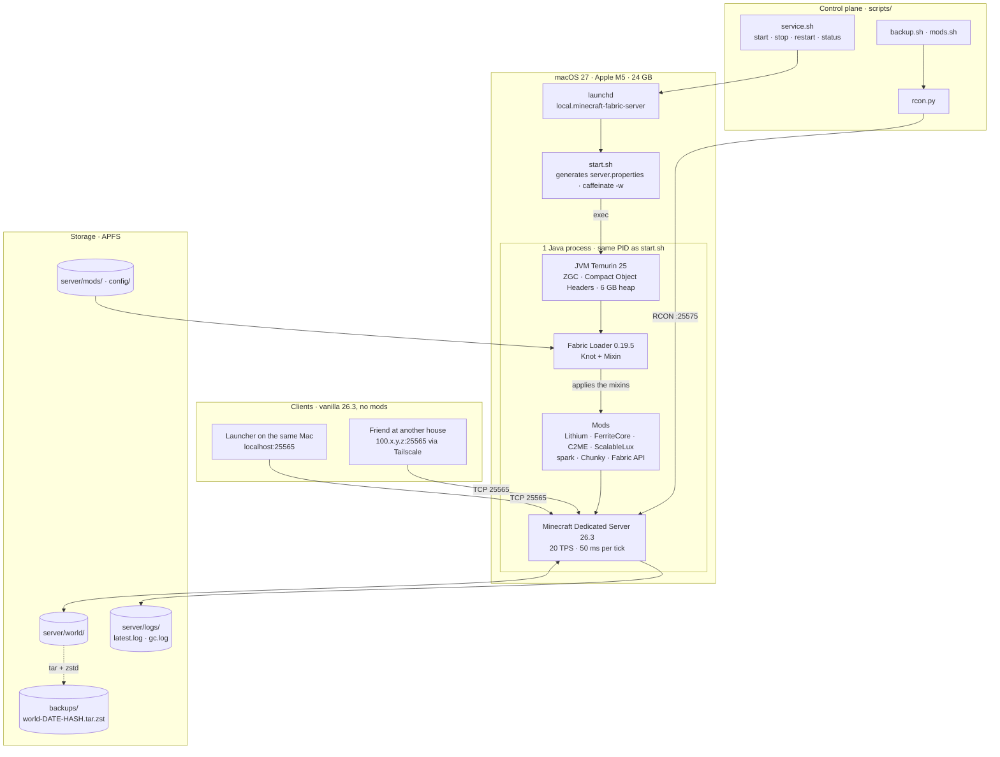
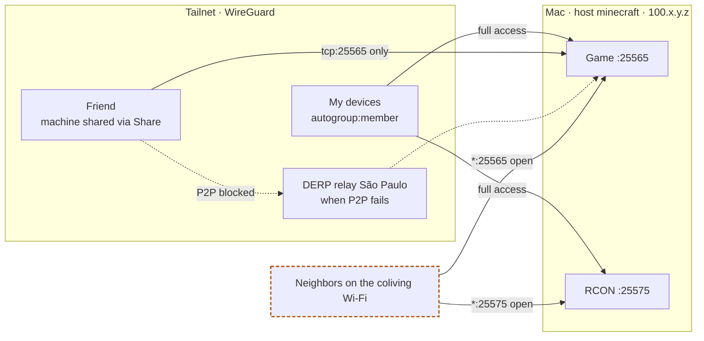
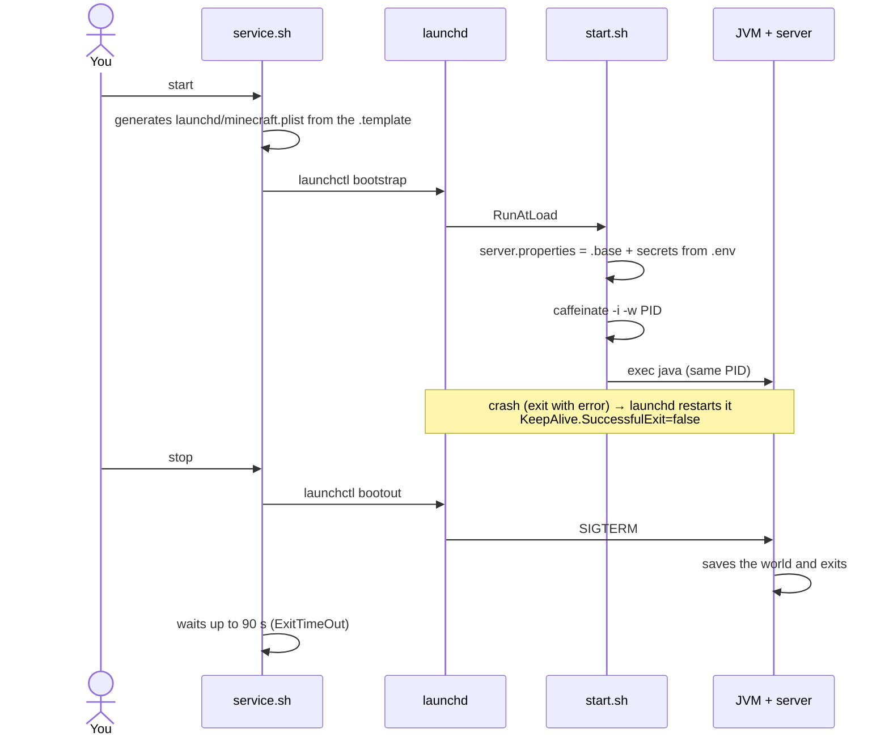
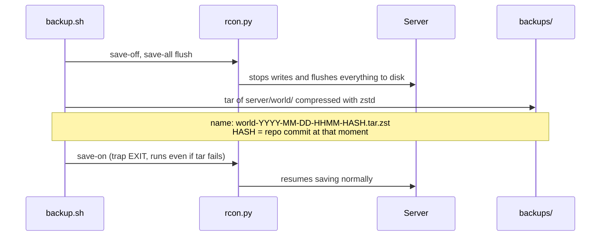

# Architecture

How the server is put together: processes, network, boot and backup flows, and where each file lives. Versions, memory, and the reasoning behind each choice are in [STACK.md](STACK.md).

## Overview

- **A single process.** `start.sh` ends with `exec`, so the JVM inherits its PID. `launchd` supervises that PID, and `caffeinate -w` holds off sleep while it exists.
- **Mods on the server only.** Fabric Loader injects the mods into the game bytecode (Mixin). The client joins with vanilla 26.3.
- **Control from outside the game.** The scripts talk to the server over RCON, on port 25575, with the password from `scripts/.env`.

## Network

Details and step by step in [MULTIPLAYER.md](MULTIPLAYER.md).

| Layer | What it guarantees |
|---|---|
| Tailscale | Nothing is exposed to the internet; no port open on the router |
| Access policy | Friend reaches only `tcp:25565`; RCON is invisible to them |
| `online-mode=true` | Nobody gets in pretending to be another Microsoft account |
| Whitelist | Only approved nicks get in, even with network access |

**Open risk:** Java listens on `*:25565` and `*:25575`, so anyone on the same Wi-Fi reaches both ports through the local IP. The fix is planned for v0.2.0.

## Starting and stopping

## Backup

The server stays up during the backup. `save-off` ensures the world does not change in the middle of `tar`.

## Project files

Root: `~/Servers/minecraft/`.

- `versions.env`: JDK, game, loader, and installer versions
- `mods.txt`: which mods you want (Modrinth slugs)
- `mods.lock`: exact version and sha512 of each mod
- `README.md`, `CHANGELOG.md`: repository entry point and release history
- `docs/`
  - `ARCHITECTURE.md`: this file
  - `STACK.md`: versions, memory, and technical decisions
  - `SETUP.md`: installation step by step
  - `SCRIPTS.md`: what each script does
  - `OPERATIONS.md`: day to day, logs, and players
  - `MULTIPLAYER.md`: connecting friends through Tailscale
  - `GIT.md`: versioning, branches, commits, and releases
- `.gitmessage`, `.githooks/`: commit convention and secrets barrier
- `launchd/minecraft.plist.template`: job template; the real plist is generated and kept out of Git
- `network/tailscale-policy.example.hujson`: policy template; the real one, with the IP, is kept out of Git
- `scripts/`
  - `install.sh`: installs Minecraft + Fabric
  - `service.sh`: starts and stops through launchd
  - `start.sh`: generates `server.properties` and starts the JVM
  - `mods.sh`: `update` and `sync`
  - `rcon.py`: sends commands to the server
  - `backup.sh`: world snapshot
  - `lib.sh`: shared functions
  - `.env`: passwords, out of Git
- `server/`: runtime, almost all out of Git
  - `server.properties.base`: versioned config, no passwords
  - `config/`: mod configs, versioned
  - `whitelist.json`, `ops.json`: local, out of Git
  - `mods/`, `world/`, `logs/`, `*.jar`: out of Git
- `backups/`: out of Git

## Terms

| Term | Meaning |
|---|---|
| localhost | This same computer. It is the address the game uses when the server is on the same Mac. |
| Port 25565 | The server's entry port for the game. 25575 is the RCON one. |
| RCON | Channel for sending commands to the server without being in the game. It is what `rcon.py` uses. |
| launchd | The macOS service manager. Keeps the server running in the background and restarts it if it goes down. |
| MSPT | Milliseconds per tick. The game runs 20 ticks per second, so the limit is 50 ms. Above that, the game lags. |
| DERP | Tailscale relay. Carries the traffic when the direct connection between two computers is blocked. |
