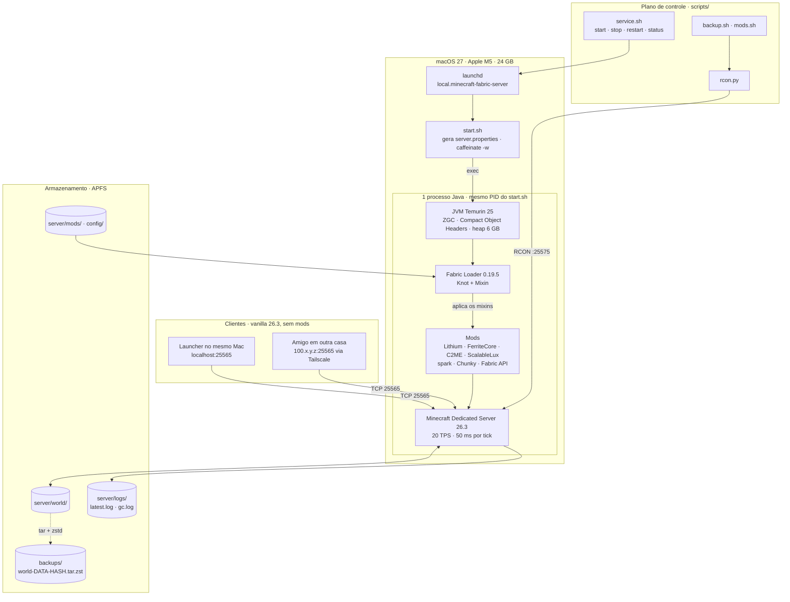
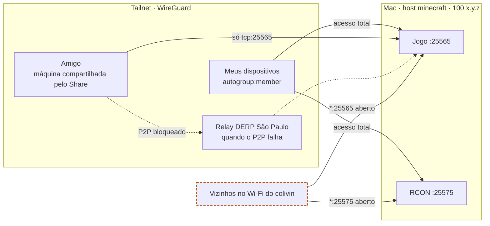
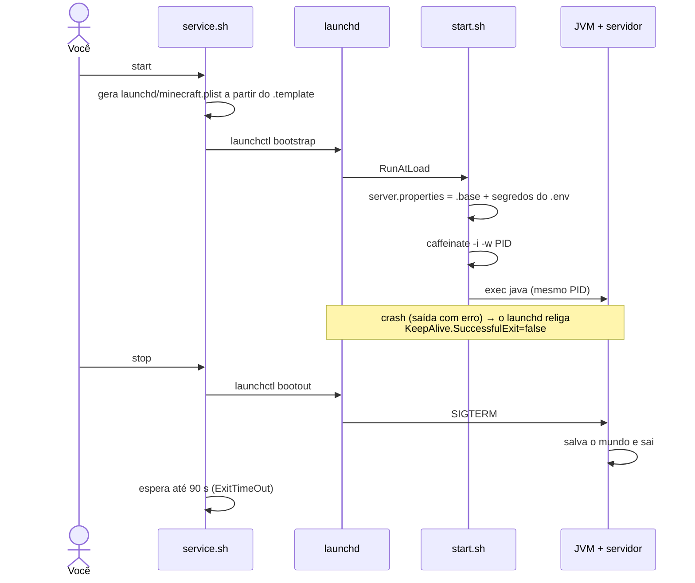
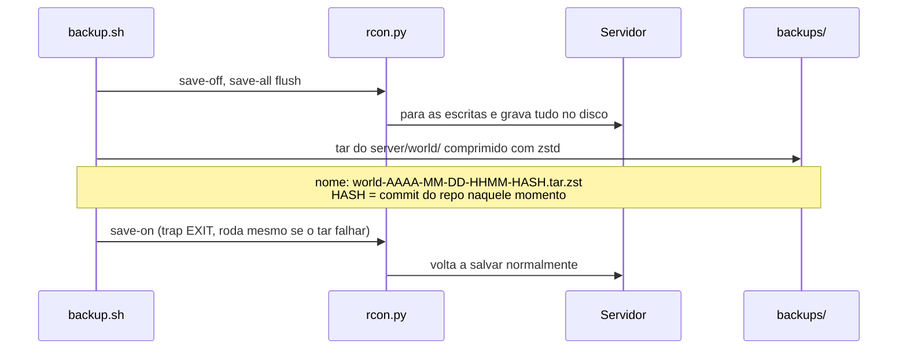

# Arquitetura

Como o servidor é montado: processos, rede, fluxos de boot e backup, e onde cada arquivo fica. Versões, memória e o porquê de cada escolha estão em [STACK.md](STACK.md).

## Visão geral

- **Um processo só.** O `start.sh` termina com `exec`, então a JVM herda o PID dele. O `launchd` supervisiona esse PID, e o `caffeinate -w` segura o sleep enquanto ele existir.
- **Mods só no servidor.** O Fabric Loader injeta os mods no bytecode do jogo (Mixin). O cliente entra com o 26.3 vanilla.
- **Controle fora do jogo.** Os scripts falam com o servidor pelo RCON, na porta 25575, com a senha do `scripts/.env`.

## Rede

Detalhes e passo a passo em [MULTIPLAYER.md](MULTIPLAYER.md).

| Camada | O que garante |
|---|---|
| Tailscale | Nada fica exposto na internet; nenhuma porta aberta no roteador |
| Política de acesso | Amigo alcança só `tcp:25565`; o RCON fica invisível para ele |
| `online-mode=true` | Ninguém entra fingindo ser outra conta Microsoft |
| Whitelist | Só nicks liberados entram, mesmo com acesso à rede |

**Risco aberto:** o Java escuta em `*:25565` e `*:25575`, então quem está no mesmo Wi-Fi alcança as duas portas pelo IP local. A correção está planejada para a v0.2.0.

## Ligar e desligar

## Backup

O servidor continua ligado durante o backup. O `save-off` garante que o mundo não muda no meio do `tar`.

## Arquivos do projeto

Raiz: `~/Servers/minecraft/`.

- `versions.env`: versões do JDK, jogo, loader e installer
- `mods.txt`: quais mods você quer (slugs do Modrinth)
- `mods.lock`: versão exata e sha512 de cada mod
- `README.md`, `CHANGELOG.md`: entrada do repositório e histórico de releases
- `docs/`
  - `ARQUITETURA.md`: este arquivo
  - `STACK.md`: versões, memória e decisões técnicas
  - `SETUP.md`: passo a passo de instalação
  - `SCRIPTS.md`: o que cada script faz
  - `OPERACAO.md`: dia a dia, logs e jogadores
  - `MULTIPLAYER.md`: conexão de amigos pelo Tailscale
  - `GIT.md`: versionamento, branches, commits e releases
- `.gitmessage`, `.githooks/`: padrão de commit e barreira de segredos
- `launchd/minecraft.plist.template`: modelo do job; o plist real é gerado e fica fora do Git
- `network/tailscale-policy.example.hujson`: modelo da política; a real, com o IP, fica fora do Git
- `scripts/`
  - `install.sh`: instala Minecraft + Fabric
  - `service.sh`: liga e desliga pelo launchd
  - `start.sh`: gera o `server.properties` e sobe a JVM
  - `mods.sh`: `update` e `sync`
  - `rcon.py`: manda comandos para o servidor
  - `backup.sh`: snapshot do mundo
  - `lib.sh`: funções comuns
  - `.env`: senhas, fora do Git
- `server/`: runtime, quase tudo fora do Git
  - `server.properties.base`: config versionada, sem senhas
  - `config/`: configs dos mods, versionado
  - `whitelist.json`, `ops.json`: locais, fora do Git
  - `mods/`, `world/`, `logs/`, `*.jar`: fora do Git
- `backups/`: fora do Git

## Termos

| Termo | Significado |
|---|---|
| localhost | Este mesmo computador. É o endereço que o jogo usa quando o servidor está no mesmo Mac. |
| Porta 25565 | A porta de entrada do servidor para o jogo. A 25575 é a do RCON. |
| RCON | Canal para mandar comandos ao servidor sem estar dentro do jogo. É o que o `rcon.py` usa. |
| launchd | O gerenciador de serviços do macOS. Mantém o servidor ligado em segundo plano e religa se ele cair. |
| MSPT | Milissegundos por tick. O jogo roda 20 ticks por segundo, então o limite é 50 ms. Acima disso, o jogo fica lento. |
| DERP | Relay do Tailscale. Carrega o tráfego quando a conexão direta entre dois computadores é bloqueada. |
