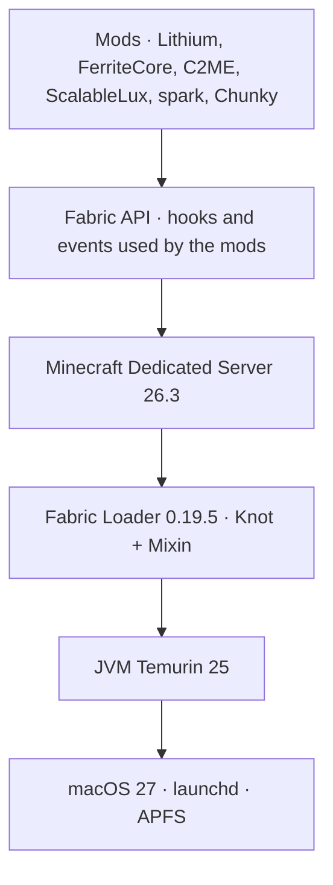
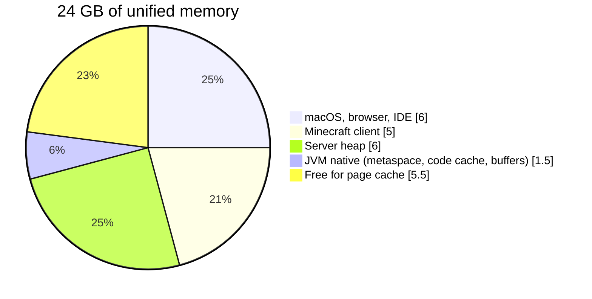

# Stack

Versions, memory budget, and the decisions behind each choice. The source of truth for versions is `versions.env` and `mods.lock`; this page explains the why.

## Components

| Component | Version | Role | Why |
|---|---|---|---|
| Minecraft Java Edition | 26.3 | base | Latest stable. The Mojang manifest requires `javaVersion 25`. |
| Eclipse Temurin JDK | 25 (LTS) | runtime | Version required by the game, and LTS. 27 is still installed; `lib.sh` pins 25. |
| Fabric Installer | 1.1.2 | setup | Generates `fabric-server-launch.jar` and downloads the official `server.jar`. |
| Fabric Loader | 0.19.5 | loader | Knot classloader + Mixin. Injects the mods into the server. |
| Fabric API | 0.161.0+26.3 | lib | Dependency of C2ME, spark, and Chunky. |
| Lithium | mc26.3-0.26.1 | tick | Optimizes AI, physics, collision, and hoppers without changing vanilla behavior. |
| FerriteCore | 9.0.0 | memory | Deduplicates block states and models. Reduces heap usage. |
| C2ME | 0.4.2-alpha.0.88 | chunks | Parallel chunk generation, I/O, and loading. Makes use of the M5 cores. |
| ScalableLux | 0.3.0-alpha.0.6 | light | Parallel lighting engine, successor to Starlight. |
| spark | 1.10.187 | observability | CPU, allocation, and GC profiler; live MSPT and TPS. |
| Chunky | 1.5.3 | pre-generation | Generates the world before playing. Takes the worldgen cost out of the tick. |

Versions checked on 2026-09-27 against the Fabric Meta and Modrinth APIs and the Mojang manifest. The C2ME and ScalableLux alphas are the only builds for 26.3.

**Left out of the stack:** Krypton (no build for 26.3), VMP (only helps with dozens of players), ServerCore (changes gameplay).

## Process layers

Each layer runs on top of the one below. The loader sits below the game because it is what loads the Minecraft classes and applies the mixins before the game starts.

## Memory budget

Most demanding scenario: you play on the same Mac that runs the server.

If the server runs alone, raise it to `MC_HEAP=8G`. Beyond that the gain is nil for a few players and ZGC just scans more memory.

Measured idle and paused (`pause-when-empty-seconds=60`): about 1.3 GB of RSS and 19% of one core.

## Technical decisions

| Decision | Reason |
|---|---|
| ZGC instead of G1 | Pauses under 1 ms. A long GC pause shows up in the game as a freeze. Costs a bit more CPU, which the M5 has plenty of. |
| Compact Object Headers | Stable in JDK 25 (JEP 519). Each object is 4 bytes smaller. With millions of small objects, more heap is left and the GC works less. |
| Fixed 6 GB heap | `-Xms` equal to `-Xmx` and `AlwaysPreTouch`: memory is reserved at boot, not in the middle of the game. Change it with `MC_HEAP=8G`. |
| Mods on the server only | The client joins with vanilla 26.3 from the launcher. No need to install Fabric on the client. |
| launchd as supervisor | Restarts on crash and sends SIGTERM on shutdown; the server saves the world before exiting. The plist lives in the project, so the server does not start on its own at login. |
| `mods.txt` + `mods.lock` | `update` picks the versions and writes the lock. `sync` installs only what is in the lock, with sha512. Any machine builds the same server. |
| Native instead of Docker on the Mac | Docker on macOS runs in a Linux VM: it loses memory and disk I/O. `compose.yaml` is kept for the migration to Linux. |

## JVM flags

Defined in `scripts/start.sh`.

| Flag | Effect |
|---|---|
| `-Xms6G -Xmx6G` | Fixed heap |
| `-XX:+UseZGC` | ZGC, generational by default in JDK 25 |
| `-XX:+UseCompactObjectHeaders` | Smaller object header |
| `-XX:+AlwaysPreTouch` | Touches every heap page at boot |
| `-XX:+PerfDisableSharedMem` | Disables the `hsperfdata` metrics file in `/tmp`, whose disk writes can lengthen GC pauses |
| `--enable-native-access=ALL-UNNAMED` | Allows native access for the mods without a warning |
| `--sun-misc-unsafe-memory-access=allow` | Keeps the `Unsafe` that older mods use |
| `-Xlog:gc*:file=logs/gc.log:...` | GC log with 5 rotating 10 MB files |
