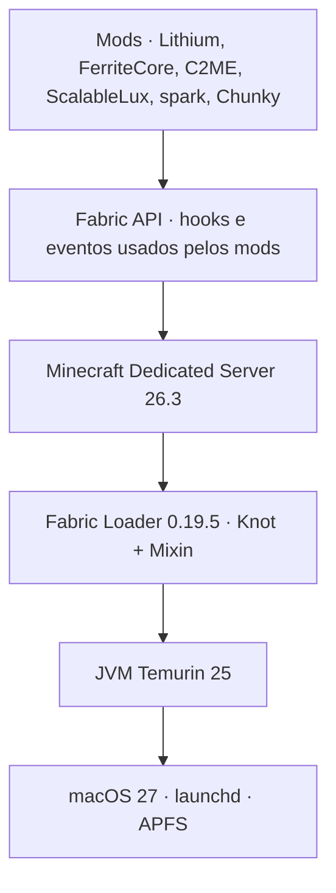
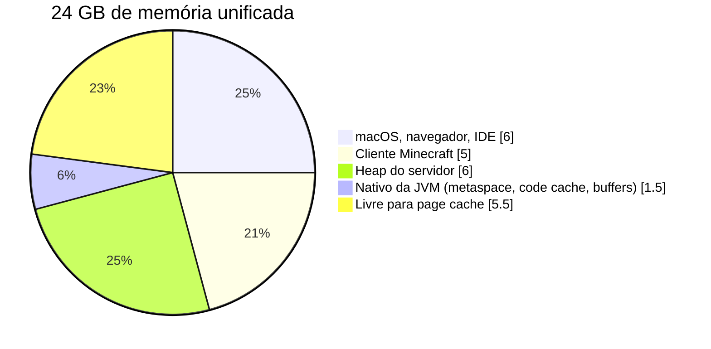

# Stack

Versões, orçamento de memória e as decisões por trás de cada escolha. A fonte da verdade das versões é o `versions.env` e o `mods.lock`; esta página explica o porquê.

## Componentes

| Componente | Versão | Papel | Por que |
|---|---|---|---|
| Minecraft Java Edition | 26.3 | base | Última estável. O manifesto da Mojang exige `javaVersion 25`. |
| Eclipse Temurin JDK | 25 (LTS) | runtime | Versão exigida pelo jogo e LTS. O 27 continua instalado; o `lib.sh` fixa o 25. |
| Fabric Installer | 1.1.2 | setup | Gera o `fabric-server-launch.jar` e baixa o `server.jar` oficial. |
| Fabric Loader | 0.19.5 | loader | Classloader Knot + Mixin. Injeta os mods no servidor. |
| Fabric API | 0.161.0+26.3 | lib | Dependência de C2ME, spark e Chunky. |
| Lithium | mc26.3-0.26.1 | tick | Otimiza IA, física, colisão e hoppers sem mudar o comportamento vanilla. |
| FerriteCore | 9.0.0 | memória | Deduplica estados de blocos e modelos. Reduz o heap usado. |
| C2ME | 0.4.2-alpha.0.88 | chunks | Geração, I/O e carregamento de chunks em paralelo. Aproveita os núcleos do M5. |
| ScalableLux | 0.3.0-alpha.0.6 | luz | Motor de iluminação paralelo, sucessor do Starlight. |
| spark | 1.10.187 | observabilidade | Profiler de CPU, alocação e GC; MSPT e TPS ao vivo. |
| Chunky | 1.5.3 | pré-geração | Gera o mundo antes de jogar. Tira o custo de worldgen do tick. |

Versões consultadas em 27/09/2026 nas APIs Fabric Meta, Modrinth e no manifesto da Mojang. Os alphas de C2ME e ScalableLux são as únicas builds para 26.3.

**Fora da stack:** Krypton (sem build para 26.3), VMP (só ajuda com dezenas de jogadores), ServerCore (muda o gameplay).

## Camadas do processo

Cada camada roda sobre a de baixo. O loader fica abaixo do jogo porque é ele que carrega as classes do Minecraft e aplica os mixins antes do jogo iniciar.

## Orçamento de memória

Cenário mais exigente: você joga no mesmo Mac que roda o servidor.

Se o servidor rodar sozinho, suba para `MC_HEAP=8G`. Acima disso o ganho é nulo para poucos jogadores e o ZGC só varre mais memória.

Medido ocioso e pausado (`pause-when-empty-seconds=60`): cerca de 1,3 GB de RSS e 19% de um núcleo.

## Decisões técnicas

| Decisão | Motivo |
|---|---|
| ZGC em vez de G1 | Pausas abaixo de 1 ms. Uma pausa longa do GC aparece no jogo como travada. Custa um pouco mais de CPU, que o M5 tem de sobra. |
| Compact Object Headers | Estável no JDK 25 (JEP 519). Cada objeto fica 4 bytes menor. Com milhões de objetos pequenos, sobra heap e o GC trabalha menos. |
| Heap fixo de 6 GB | `-Xms` igual a `-Xmx` e `AlwaysPreTouch`: a memória é reservada no boot, e não no meio do jogo. Troque com `MC_HEAP=8G`. |
| Mods só no servidor | O cliente entra com o 26.3 vanilla do launcher. Não precisa instalar Fabric no cliente. |
| launchd como supervisor | Reinicia em caso de crash e manda SIGTERM ao desligar; o servidor salva o mundo antes de sair. O plist fica no projeto, então o servidor não liga sozinho no login. |
| `mods.txt` + `mods.lock` | `update` escolhe as versões e grava o lock. `sync` instala só o que está no lock, com sha512. Qualquer máquina monta o mesmo servidor. |
| Nativo em vez de Docker no Mac | Docker no macOS roda numa VM Linux: perde memória e I/O de disco. O `compose.yaml` fica para a migração a Linux. |

## Flags da JVM

Definidas em `scripts/start.sh`.

| Flag | Efeito |
|---|---|
| `-Xms6G -Xmx6G` | Heap fixo |
| `-XX:+UseZGC` | ZGC, generacional por padrão no JDK 25 |
| `-XX:+UseCompactObjectHeaders` | Cabeçalho de objeto menor |
| `-XX:+AlwaysPreTouch` | Toca todas as páginas do heap no boot |
| `-XX:+PerfDisableSharedMem` | Desliga o arquivo de métricas `hsperfdata` em `/tmp`, cuja escrita em disco pode alongar pausas do GC |
| `--enable-native-access=ALL-UNNAMED` | Libera acesso nativo para os mods sem aviso |
| `--sun-misc-unsafe-memory-access=allow` | Mantém o `Unsafe` que mods antigos usam |
| `-Xlog:gc*:file=logs/gc.log:...` | GC log com 5 arquivos rotativos de 10 MB |
